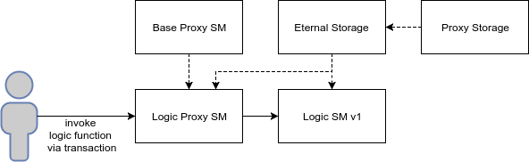
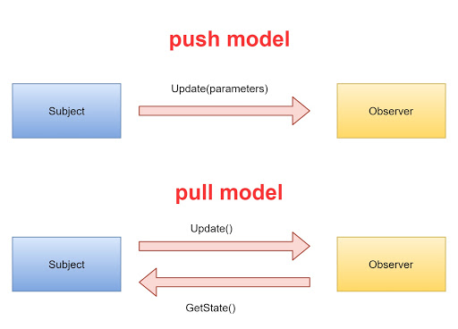
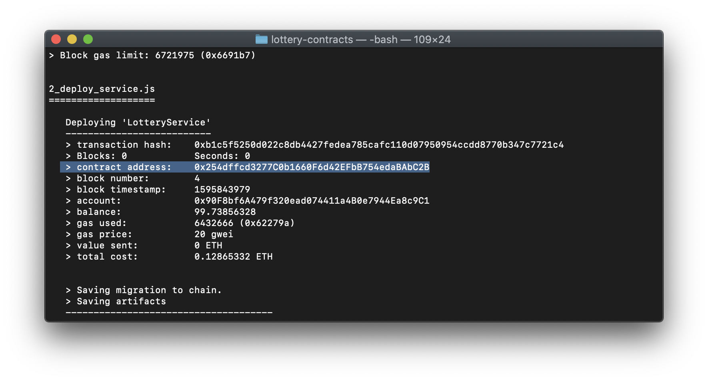
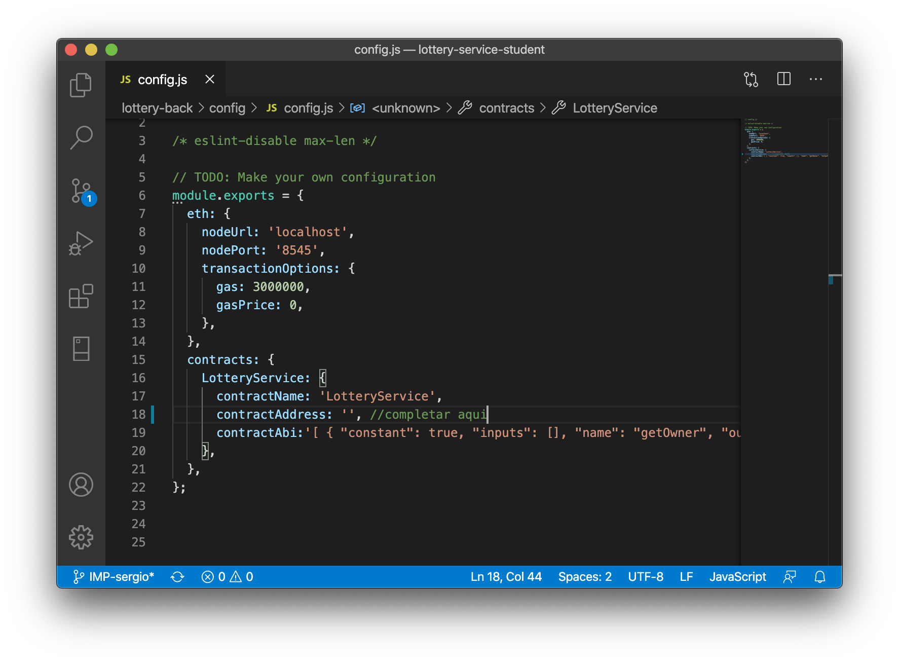

#### Práctica Lotería

El presente documento recoge las explicaciones necesarias para la comprensión de la solución propuesta a la práctica del módulo **Desarrollo Dapps Ethereum**.

Para el desarrollo de dicha práctica se han creado cuatro contratos a los que hemos llamado _Lottery, LotteryService_, _LotteryStorage_ y _LotteryLogic_. Por un lado están los contratos que se encargan del almacenaje de los datos y que serán inmutables, por otro lado tenemos el contrato que gestionará el servicio de lotería el cuál siempre estará activo desde que se despliegue y por último un contrato dónde escribiremos toda la lógica interna de cada lotería donde puede ser modificado en el futuro estos requisitos sin miedo a caer el sistema previamente desplegado.

## 1.- Contratos

### Lottery

Este es uno de los dos contratos que hemos generado para almacenar la información de los usuarios y la información relativa a cada lotería creada, esta lotería es creada por los usuarios. 

#### Interfaz

Lo primero que definimos es una interfaz para poder dar escalabilidad al proyecto de loterías, de esta manera si algún requisito quiere ser modificado en un futuro basta con modificar el fichero de _LotteryLogic_ y nos permite abstraer toda la lógica sin que el usuario se entere y nos permite guardar todas las loterías anteriores sin perderlas. Las funciones definidas en el siguiente bloque de código serán explicadas más adelante en este documento.

```java
interface LogicInterface {
    function addParticipant(Lottery _ml, address _participant, uint _cost) external;
    function checkLotteryParticipation(Lottery _ml) external returns (bool);
    function rafflePrize(Lottery _ml, uint _seed) external;
    function withdrawParticipation(Lottery _ml, address _receiver) external;
}
```

Una vez definida la interfaz, lo primero que debemos definir en este contrato son los atributos que tienen todas las loterías, <span style="color:blue">_número máximo de participantes, precio de cada participación, bote a recaudar_</span> y <span style="color:blue"> _premio del sorteo_ </span>, además hemos añadido  <span style="color:blue">_dirección del propietario_</span>, <span style="color:blue"> _dirección del ganador_ </span>y<span style="color:blue"> _estado lotería_ </span>, la cual puede tener 4 estados distintos.

+ LotteryActive
+ LotteryFinished
+ LotteryTerminated
+ LotteryFailed

Estos 4 estados se han definido siguiendo el patrón de [State Machine](https://fravoll.github.io/solidity-patterns/state_machine.html), basado en las máquinas de Turing, ya que una lotería sólo puede estar en un estado a la vez.

Para tener constancia de los participantes que hay en una lotería, hemos creado un mapping con el registro de participantes, donde tenemos guardada su dirección como clave y nos devolverá _True_ o _False_ dependiendo de sí ya había participado o no en esa lotería.

```java
contract Lottery {

    address[] public participants;
    mapping (address => bool) regParticipants;

    mapping (address => uint) credits;

    uint max_participants;
    uint ticket_cost;
    uint pot;
    uint prize;

    address winner;
    address owner;

    Stages stage;

    enum Stages {
        LotteryActive,
        LotteryFinished,
        LotteryTerminated,
        LotteryFailed
    }
...
}
```

#### Constructor

A continuación, generamos un constructor público para asignar los valores a los atributos de nuestra lotería, marcando esta como activa.

```java
constructor(uint _max_participants, uint _ticket_cost, uint _prize, uint _pot, address _lotteryLogic, address _sender) public {
        max_participants = _max_participants;
        ticket_cost = _ticket_cost;
        prize = _prize;
        pot = _pot;
        stage = Stages.LotteryActive;
        logicContract = LogicInterface(_lotteryLogic);
        owner = _sender;
    }
```

#### Funciones

##### Lógica de la interfaz

Extraemos toda la lógica de la lotería en un contrato que se puede actualizar para dar mayor sostenibilidad al proyecto, de esta manera tendremos gran escalabilidad a la hora de modificar la lógica en un futuro. Para ello se ha creado la interfaz previamente explicada al comienzo del documento, asignando estos datos al contrato que utilizaremos para devolver las características con las funciones.

```java
LogicInterface logicContract;
function setLogicInterfaceAddress(address _address, address _sender) external  {
  require(_sender == owner, "Solo el dueño de la loteria");
  logicContract = LogicInterface(_address);
}
function getLogicContract() public view returns (LogicInterface) {
  return logicContract;
}
```

Con el objeto de logicContract previamente creado por la interfaz y las funciones definidas para el contrato de Lottery se puede acceder a las características de esa lotería. 

##### Rifa

Se ha definido una función en la lotería para rifar el premio siempre y cuando la persona que haga esta rifa sea el propietario de la lotería, interaccionando con el contrato de la lógica que realizará las comprobaciones necesarias para validar esta rifa y asignará un ganador para el sorteo de esta lotería.

```java
function rafflePrize(uint _seed, address _sender) public  {
  require(_sender == owner, "Solo el dueño de la loteria");
  logicContract.rafflePrize(this, _seed);
}
```

##### Participantes

Además se han creado distintos métodos getters and setters para los participantes como son <span style="color:blue">añadir participante a la interfaz, asignar estado al participante (participa o no en la lotería), añadir participante al array de participantes,   obtener el número máximo de participantes de una lotería, obtener participantes de una lotería y obtener participante (saber si está o no). </span>

Para añadir un participante, este contrato interacciona con el contrato de la lógica que se encarga de comprobar si se cumplen los requisitos o no para añadir un nuevo participante.

```java
function addParticipant(address _participant, uint _cost) public {
  logicContract.addParticipant(this, _participant, _cost);
}

function setParticipantState(address _participant, bool _state) external{
  regParticipants[_participant] = _state;
}

function newParticipant(address _participant) external{
  participants.push(_participant);
}

function getMaxParticipants() public view returns(uint){
  return max_participants;
}

function getParticipants() public view returns(address[] memory){
  return participants;
}

function hasParticipant(address _participant) public view returns(bool){
  return regParticipants[_participant];
}
```

##### Boleto

Para el coste del boleto hemos creado el getter de <span style="color:blue">obtener precio del boleto</span>

```java
function getTicketCost() public view returns(uint){
	return ticket_cost;
}
```

##### Bote y premio

Asimismo, para <span style="color:blue">obtener bote, obtener premio</span> tenemos sus respectivos getter.

```java
// getters/setters pot
function getPot() public view returns(uint){
	return pot;
}

// getters/setters prize
function getPrize() public view returns(uint){
	return prize;
}
```

##### Ganador

En el caso del ganador, tenemos el getter de <span style="color:blue">obtener ganador</span> y el setter <span style="color:blue">asignar ganador</span> más la funcionalidad de <span style="color:blue">enviar la cantidad de dinero</span>.

```java
// getters/setters winner
function getWinner() public view returns(address){
	return winner;
}

function setWinner(address _winner) public {
  winner = _winner;
}

function sendWei(address payable _to, uint _amount) public {
  _to.transfer(_amount);
}
```

##### Estados de la lotería

En el caso del estado de la lotería, se han creado getters and setters para <span style="color:blue">conocer el estado actual, conocer el estado por valor pasado, asignar estado, asignar estado por valor pasado</span> además de una comprobador del estado por valor. Se necesita utilizar Abi.encodePacked para realizar un parseo de los string y que permita su comprobación.

```java
function getStage() public view returns(string memory){
  if (Stages.LotteryActive == stage ) return "LotteryActive";
  if (Stages.LotteryFinished == stage ) return "LotteryFinished";
  if (Stages.LotteryTerminated == stage ) return "LotteryTerminated";
  if (Stages.LotteryFailed == stage ) return "LotteryFailed";
}

function getCurrentStage() public view returns(Stages){
  return stage;
}
    
function getStagesByValue(string memory _value) public pure returns (Stages) {
  if (keccak256(abi.encodePacked(_value)) == keccak256(abi.encodePacked("LotteryActive"))) return Stages.LotteryActive;
  else if (keccak256(abi.encodePacked(_value)) == keccak256(abi.encodePacked("LotteryFinished"))) return Stages.LotteryFinished;
  else if (keccak256(abi.encodePacked(_value)) == keccak256(abi.encodePacked("LotteryTerminated"))) return Stages.LotteryTerminated;
  else if (keccak256(abi.encodePacked(_value)) == keccak256(abi.encodePacked("LotteryFailed"))) return Stages.LotteryFailed;
}
    
function setStage(Stages _stage) internal {
  stage = _stage;
}
    
function setStageByValue(string calldata _value) external {
  stage = getStagesByValue(_value);
}
    
function isCurrentStageByValue(string memory _value) public view returns (bool) {
  if (getStagesByValue(_value) == stage) {
    return true;
  }
  return false;
}

function getOwner()public view returns(address){
  return owner;
}

function getBalance()public view returns(uint){
  return address(this).balance;
}
```

Se han definido unas funciones siguiendo los patrones de [Pull Over Push](https://fravoll.github.io/solidity-patterns/pull_over_push.html) y [Check Effects Interactions](https://fravoll.github.io/solidity-patterns/checks_effects_interactions.html), ambos serán explicados más adelante. 

Con la función de <span style="color:blue">devolver participación</span>, el contrato de lotería vuelve a interaccionar con el contrato de la lógica para comprobar si se cumplen las condiciones de obtener el dinero (Lotería Fallida o Lotería Finalizada), de esta manera incentivamos a los usuarios a reclamar sus premios aplicando de esta manera el patrón.

```java
function allowForPull(address receiver, uint amount) external {
  credits[receiver] += amount;
}

function withdrawParticipation(address _user) public {
  logicContract.withdrawParticipation(this, _user);
}

function getUserCredits(address _user) public view returns(uint){
  return credits[_participant];
}

function setUserCredits(address _user, uint _amount) public {
  credits[_participant] = _amount;
}

function sendWei(address _to, uint _amount) public {
  _to.transfer(_amount);
}
```

### LotteryStorage

Este contrato se encargará de almacenar toda la información de la lotería, creando de este modo otra capa de seguridad como es su <span style="color:blue">última versión, el propietario, un mapeo del almacenamiento de loterías</span> donde la clave es un _address_ y su valor el contrato de Lotería.

```java
contract LotteryStorage {
    address owner = msg.sender;
    address latestVersion;

    // Structures where loteries are saved
    mapping(address => Lottery) lotteryStorage;
    Lottery[] lotteries;
  ...
}
```

#### Funciones

##### Última versión

Por cómo ha sido planteada la lógica, es necesario crear un modificador para saber que el contrato que llama a este modificador es la misma que ha creado la última lotería.

```java
modifier onlyLatestVersion() {
  require(msg.sender == latestVersion, 'only owner');
  _;
}
```

##### Actualizar versión

También es necesario generar una función que nos actualice la versión de la lotería siempre y cuando la persona que quiera actualizar la lotería sea el propietario de la misma.

```java
function upgradeVersion(address _newVersion, address _sender) public {
  require(_sender == owner,'only owner');
  latestVersion = _newVersion;
}
```

Como en todas las clase se han definido unos métodos getters y setters para obtener y asignar los atributos del contrato. Los getter generados son para <span style="color:blue">obtener la lotería</span> pasando la dirección de la lotería a buscar y <span style="color:blue">obtener todas las loterías almacenadas</span>.

```java
function getLottery(address _key) external view returns(Lottery){
  return lotteryStorage[_key];
}

function getLotteries() external view returns (Lottery[] memory){
  return lotteries;
}
```

En cuanto a los setter, cabe destacar que <span style="color:blue">asignar lotería</span> llamará al modifier previamente comentado y sólo se asignará la lotería si es la última versión, <span style="color:blue">añadir lotería</span> se añadirá esta lotería al array de loterías y <span style="color:blue">asignar créditos a usuario</span>.

```java
function setLottery(address _key, Lottery _value) external {
  lotteryStorage[_key] = _value;
  lotteries.push(_value);
}
```

Se ha creado un método para <span style="color:blue">borrar lotería</span> por si se quiere eliminar esta.

```java
function deleteLottery(address _key) external onlyLatestVersion {
  delete lotteryStorage[_key];
}
```

### LotteryLogic

Este contrato hereda del contrato _Ownable_ y será el encargado de administrar toda la lógica de las loterías, pudiendo modificar los métodos según los requisitos en cada momento.

A su vez, se ha incluido la librería _SafeMath.sol_ para así llevar a cabo las operaciones matemáticas de forma segura y evitar desbordamientos.

```java
using SafeMath for uint256;
```

Abstraer toda la lógica de las loterías en un único contrato, ha sido una buena práctica para la escalabilidad del proyecto ya que no dejará nunca sin servicio al servidor teniendo operativa la DApp 24/7.

Se han definido varias funciones que serán explicadas con más detalle a continuación.

#### Funciones

##### Requisitos mínimos

Esta función será llamada cada vez que entre una participación, comprobando que se cumplan todos los requisitos para que una persona pueda realizar la participación. Los requisitos son los siguientes:

+ Comprobar que el participante no haya participado ya en este sorteo.
+ Comprobar que la tasa de entrada al sorteo sea igual que la tasa del boleto.
+ Comprobar que la lotería está en estado activo.

```java
function passMinimalRequirements(Lottery _lottery, address _participant, uint _value) public view returns (bool) {
  if (_lottery.hasParticipant(_participant)) return false;
  if (_value != _lottery.getTicketCost()) return false;
  if (!_lottery.isCurrentStageByValue("LotteryActive")) return false;
  return true;
}
```

##### Añadir participante

Esta función permite añadir un nuevo participante a la lotería, asignando previamente el estado del participante a true. Para poder añadir un participante, este debe haber pasado los requisitos mínimos y utiliza los métodos del contrato lotería previamente explicados para asignarle el estado al participante.

```java
function addParticipant(Lottery _lottery, address _participant, uint _cost) public payable {
  require(passMinimalRequirements(_lottery, _participant, _cost), "No has pasado los requisitos minimos");
  _lottery.setParticipantState(_participant, true);
  _lottery.newParticipant(_participant);
  _lottery.allowForPull(_participant, _cost);
  checkLotteryParticipation(_lottery);
}
```

##### Comprobación de la lotería

Esta función comprueba si tenemos el número máximo de participantes para pasar la lotería a finalizada, sin embargo si no se recauda el bote estimado para ese sorteo se debe pasar la lotería a estado fallida. Con esta función se aplica así el patrón de [State Machine](https://fravoll.github.io/solidity-patterns/state_machine.html).

```java
function checkLotteryParticipation(Lottery _lottery) public {
  if(_lottery.getParticipants().length == _lottery.getMaxParticipants()) {
    if(_lottery.getMaxParticipants().mul(_lottery.getTicketCost()) < _lottery.getPot()){
      _lottery.setStageByValue("LotteryFailed");
    }else {
      _lottery.setStageByValue("LotteryFinished");
    }
  }
}
```

##### Hacer sorteo

Para realizar la rifa del sorteo se debe chequear que la lotería no está finalizada. Además de asignar al ganador y finalizar el estado de la lotería debemos permitir al ganador y al propietario de la lotería reclamar lo que es suyo.

```java
function rafflePrize(Lottery _lottery, uint _seed) public {
  require(_lottery.isCurrentStageByValue("LotteryFinished"), "Lottery not Finished");
  uint winnerIndex = uint(keccak256(abi.encodePacked(block.difficulty + block.timestamp + _seed))).mod(_lottery.getMaxParticipants());
  _lottery.setWinner(_lottery.getParticipants()[winnerIndex]);
  _lottery.setStageByValue("LotteryTerminated");

  _lottery.allowForPull(_lottery.getWinner(), _lottery.getPrize());
  _lottery.allowForPull(_lottery.getOwner(), _lottery.getPot().sub(_lottery.getPrize()));
}
```

##### Recuperar dinero

Esta función permite recuperar el dinero en caso de que la lotería resulte fallida, devolviendo el valor del coste del boleto al participante.

La lotería si está terminada también dará el dinero si lo mereces.

```java
function withdrawParticipation(Lottery _lottery, address payable _receiver) public {
  if(_lottery.isCurrentStageByValue("LotteryFailed")){
    payWei(_lottery, _receiver);
  }

  if(_lottery.isCurrentStageByValue("LotteryTerminated")){

    if (_receiver == _lottery.getWinner() && _receiver == _lottery.getOwner()) {
      payWei(_lottery, _receiver);
    }
  }
}
```

##### Pagar wei

Simplemente comprobará el crédito a pagar obteniendo el dinero de la lotería y enviándolo a la dirección que debe recibir el dinero.

```java
function payWei(Lottery _lottery, address payable _receiver) internal {
  uint amount = _lottery.getUserCredits(_receiver);

  require(amount != 0,"No eth to receive");
  require(_lottery.getBalance() >= amount,"Contract has not enougth eth");

  _lottery.setUserCredits(_receiver,0);
  _lottery.sendWei(_receiver,amount);
}
```

### LotteryService

Este contrato hereda del contrato Ownable y en el se ejecutan todas las funciones y eventos que son llamados desde el front end de la aplicación, para que nuestro servicio de loterías siempre tenga una lógica y un almacenamiento por defecto, se llamarán a los contratos previamente explicados _LotteryLogic_ y _LotteryStorage_.

```java
contract LotteryService is Ownable {
  event HasFinished(address _loteryId);

  uint private numberOfLotteries;

  address lotteryLogic = address(new LotteryLogic()); // Creamos la lógica 1.0

  LotteryStorage lotteryStorage = new LotteryStorage();  // Creamos el storage 1.0
  
  ...
}

```

#### Funciones

##### Asignar lógica de lotería

```java
function setLotteryLogic(address _lotteryLogic) public onlyOwner {
  lotteryLogic = _lotteryLogic;
}
```

##### Comprobar lógica de interfaz

Este modificador actualizará la dirección de la lógica en caso de que la lotería haya subido de versión.

```java
modifier checkLogicInterface(address _lotteryId) {
  if (address(lotteryStorage.getLottery(_lotteryId).getLogicContract()) != lotteryLogic) {
 lotteryStorage.getLottery(_lotteryId).setLogicInterfaceAddress(lotteryLogic, msg.sender);
  }
  _;
}
```

##### Asignar almacenamiento de lotería

Almacena todas las loterías guardadas aplicando el patrón de [Eternal Storage](https://fravoll.github.io/solidity-patterns/eternal_storage.html). Interacciona con el contrato de _LotteryStorage_.

```java
function setLotteryStorage(address _lotteryStorageAddr) public onlyOwner {
  lotteryStorage = LotteryStorage(address(_lotteryStorageAddr));
  lotteryStorage.upgradeVersion(address(this), msg.sender);
}

function getLotteryStorage() public view returns(address){
  return address(lotteryStorage);
}

modifier isStorageSet() {
  require(address(lotteryStorage) != address(0),'Need storage');
  _;
}
```

##### Crear lotería

Para poner el funcionamiento todo el sistema creado, se debe crear un método para crear la lotería en el sistema. Interacciona con el contrato de _Lottery_ y con _LotteryStorage_  para crear un nuevo objeto de Lotería que será añadida al almacemiento de loterías.

```java
function createLottery(uint _max_participants, uint _participant_cost, uint _prize, uint _pot) public {
  Lottery lottery = new Lottery(_max_participants, _participant_cost, _prize, _pot, lotteryLogic, msg.sender);
  lotteryStorage.setLottery(address(lottery), lottery);
  numberOfLotteries++;
}
```

##### Añadir participante

Lo más importante tras haber generado la lotería es poder añadir a nuevos participantes al sorteo. Utilizando los métodos del contrato _LotteryStorage_ añadimos a los participantes y envíamos el precio de participación a la lotería.

```java
function addParticipant(address _lotteryId) public payable checkLogicInterface(_lotteryId) {
    lotteryStorage.getLottery(_lotteryId).addParticipant(msg.sender, msg.value);
    address(lotteryStorage.getLottery(_lotteryId)).transfer(msg.value); //Sends money to the Lottery
    }
```

##### Rifar premio

Función para rifar el premio interaccionando con el contrato _LotteryStorage_.

```java
function rafflePrize(address _lotteryId) public checkLogicInterface(_lotteryId){
        lotteryStorage.getLottery(_lotteryId).rafflePrize(numberOfLotteries, msg.sender);
    }
```

##### Retirar participación

Función para retirar los fondos de la lotería.

```java
function withdrawParticipation(address _lotteryId) public payable checkLogicInterface(_lotteryId) {
        lotteryStorage.getLottery(_lotteryId).withdrawParticipation(msg.sender);
    }
```

##### Obtener loterías

Función para conseguir las loterías interaccionando con el contrato _LotteryStorage_.

```java
function getLotteries() public view returns(Lottery[] memory){
  return lotteryStorage.getLotteries();
}
```

##### Precio de la lotería

Función para obtener el precio de una lotería interaccionando con el contrato de _LotteryStorage_.

```java
function getLotteryPrize(address _lotteryId) public view returns (uint) {
  return lotteryStorage.getLottery(_lotteryId).getPrize();
}
```

##### Participantes de la lotería

Función para obtener los participantes de una lotería interaccionando con el contrato _LotteryStorage_.

```java
function getLotteryParticipants(address _lotteryId) public view returns (address[] memory){
  return lotteryStorage.getLottery(_lotteryId).getParticipants();
}
```

##### Balance de lotería

Función para obtener el balance de una lotería.

```java
function getLotteryBalance(address _lotteryId) public view returns(uint){
  return address(lotteryStorage.getLottery(_lotteryId)).balance;
}
```

##### Bote

Función para obtener el bote de una lotería.

```java
function getPot(address _lotteryId) public view returns(uint){
  return lotteryStorage.getLottery(_lotteryId).getPot();
}
```

##### Ganador

Función para obtener el ganador de una lotería.

```java
function getWinner(address _lotteryId) public view returns(address){
  return lotteryStorage.getLottery(_lotteryId).getWinner();
}
```

##### Estado de lotería

Función para obtener el estado de una lotería.

```java
function getLotteryStage(address _lotteryId) public view returns(string memory){
  return lotteryStorage.getLottery(_lotteryId).getStage();
}
```

##### Coste del boleto

Función para obtener el coste del boleto de una lotería.

```java
function getTicketCost(address _lotteryId) public view returns(uint){
  return lotteryStorage.getLottery(_lotteryId).getTicketCost();
}
```

## 2.- Patrones

Los patrones que se han utilizado en este proyecto han sido:

+ Eternal Storage
+ Pull Over Push
+ Checks Effects Interactions
+ Access Restriction
+ State Machine
+ Guard Check

### [Eternal Storage](https://fravoll.github.io/solidity-patterns/eternal_storage.html)

Pertene a los patrones de escalabilidad.

Mantiene el almacenamiento de un contrato después de actualizar el contrato inteligente. La utilización de este patrón de diseño es para que a la hora de desplegar una nueva versión del contrato inteligente pueda coexistir con versiones antiguas, aunque el viejo contrato no está actualizado a la nueva versión, todavía acumula el almacenamiento en la antigua dirección. Este patrón tenía un problema, el coste de almacenamiento en Ethereum, que fue resuelto en 2016 y consiste en separar el almacenamiento del contrato de la lógica. <span style="color:blue">En nuestra práctica hemos dividido LogicOfLottery de Lottery y LotteryStorage para aplicar este patrón. </span>



### [Pull Over Push](https://fravoll.github.io/solidity-patterns/pull_over_push.html)

Pertenece a los patrones de seguridad.

Permite delegar el riesgo en la transferencia del ether al usuario. Sigue el principio básico de nunca confiar en llamadas externas para ejecutar sin lanzar un error. Este patrón puede ser aplicado cuando se manejan múltiples transferencias en una función, evitar tomar el riesgo asociado a las transferencias, o porque exista un incentivo para que los usuarios manejen la extracción de éter por su propia cuenta. <span style="color:blue">Durante nuestra práctica hemos aplicado este patrón con los métodos de pagar premio y recuperar dinero, de este modo incentivamos al usuario a extraer el éter.</span>



### [Checks Effects Interactions](https://fravoll.github.io/solidity-patterns/checks_effects_interactions.html)

Pertenece a los patrones de seguridad.

Permite reducir la superficie de ataque para contratos maliciosos que intentan secuestrar el flujo de control después de una llamada externa. Este patrón suele aplicarse cuando no se puede evitar conceder el control a una entidad externa (por ejemplo en la retirada de fondos) y se quiere proteger las funciones frente a ataques de reentrada. <span style="color:blue">En esta práctica, dicho patrón ha sido empleado cuando se lleva a cabo la retirada de fondos por parte de los usuarios mediante la función *payWei* de *LotteryLogic* controlando que el usuario tiene dinero que retirar y el contrato suficiente balance como para transferirselo (checks), reduciendo el  saldo asociado a un usuario a 0 (effects) y llevando a cabo la transferencia correspondiente (interactions).</span>


### [Access Restriction](https://fravoll.github.io/solidity-patterns/access_restriction.html)

Pertenece a los patrones de seguridad.

Permite restringir el acceso a ciertas funcionalidades en base a criterios adecuados. <span style="color:blue">Este patrón ha sido empleado en nuestro código restringiendo las llamadas a ciertas funciones al propietario del contrato (por ejemplo en las funciones de uso excluivo de los administradores *setLotteryInterface* y *setLotteryStorage*) y controlando que el propietario de una loteria es quien lleva a cabo el sorteo de la misma.</span>

### [State Machine](https://fravoll.github.io/solidity-patterns/state_machine.html)

Pertenece a los patrones de comportamiento.

Permite a un contrato ir a través de diferentes estados con diferentes funcionalidades. Este patrón se aplica cuando un contrato tiene diferentes estados durante su ciclo de vida, <span style="color:blue">en nuestro caso lo podemos aplicar a los estados de las loterías (LotteryActive, LotteryFinished, LotteryTerminated, LotteryFailed)</span>, funciones de un contrato que sólo deben ser accesibles desde cierto estado. <span style="color:blue">Esto ha sido aplicado en nuestro código haciendo transicionar a las loterias entre sus distintos estados según la función ejecutada y restringiendo la ejecución de algunas funcionalidades según su estado, como en la retirada de dinero de los usuarios, verificando que el estado es Terminado o Fallido, o en la participación de un nuevo usuario en la loteria, controlando que se encuentra Activa.</span>


### [Guard Check](https://fravoll.github.io/solidity-patterns/guard_check.html)

Pertenece a los patrones de comportamiento.

Permite asegurar que el comportamiento de un contrato y sus parámetros de entrada son los esperados. <span style="color:blue">Este patrón ha sido aplicado en la creación de una loteria (en su constructor), controlando que los parámetros que recibe son mayores que 0, y en la retirada de fondos, comprobando que el usuario tiene fondos que retirar.</span>


## 3.- Endpoints nuevos

Como consecuencia de la posibilidad de llevar a cabo actualizaciones en la lógica de la Dapp sin tirarla por completo, surge la necesidad de incluir algún mecanismo que permita a los administradores del sistema reconectar los contratos desplegados con los nuevos que se desplieguen y que incluyen los cambios.

Así, se han implementado los siguientes endpoints:

### setLotteryInterface

Este endpoint permite cambiar el address de la lógica empleada por las loterias de *LotteryService* para que funcionen de acuerdo a las especificaciones del nuevo contrato.

La definición del endpoint se incluye a continuación puede encontrarse en el fichero *swagger.yaml*:

```yaml
/setLotteryInterface/{lottery_interface_addr}:
    x-swagger-router-controller: lotteries.controller
    put:
      description: sets the address of lottery logic
      tags:
        - lotteries
      operationId: setLotteryInterface
      produces:
        - application/json
      parameters:
        - name: private_key
          in: header
          required: true
          description: Private key of the wallet
          type: string
        - name: lottery_interface_addr
          in: path
          required: true
          description: Address of the contract
          type: string
      
      responses:
        "200":
          description: Success
          schema: {}
        default:
          description: Error
          schema: {}
```
Como puede verse, la función requiere dos parámetros: (1) la clave privada del wallet que quiere establecer la dirección de la nueva lógica (solo el propietario puede completar está función) que es enviada en la cabecera y (2) la nueva dirección del contrato *LotteryLogic* (lottery_interface_addr) que es enviada en la ruta del endpoint.

Por otro lado, la implementación de dicho endpoint se lleva a cabo en el archivo *lotteries.controller.js* de la siguiente manera:

```javascript
function setLotteryInterface(req, res) {
  const lotteryInterfaceAddr = req.swagger.params.lottery_interface_addr.value;
  const privateKey = req.headers.private_key;
  lotteriesService.setLotteryInterface(privateKey, lotteryInterfaceAddr).then((result) => {
    return res.status(200).json(result);
  }).catch((err) => {
    console.log(err);
    return res.status(400).json(err.toString());
  });
}
```

Y, finalmente, se incluye la implementación de la llamada al contrato en el archivo *lottery.service.js*, donde se establece la comunicación con el contrato:

```javascript
async function setLotteryInterface(privateKey, lotteryInterfaceAddr) {
  const user = web3.eth.accounts.privateKeyToAccount(privateKey);
  // data
  let res = await contract.methods.setLotteryLogic(lotteryInterfaceAddr)
    .send(
      {
        from: user.address,
        gasLimit: gasLimit,
        gasPrice: gasPrice
      });
  console.log(lotteryInterfaceAddr);
  return { message: res };
}
```

> Mediante la instrucción *web3.eth.accounts.privateKeyToAccount(privateKey)* se obtiene la dirección pública de la cuenta asociada a la clave privada pasada en la cabecera.

Con todo el código desarrollado, tan solo resta hacer uso de la función de la siguiente manera:

```bash
> curl --location --request PUT  'http://localhost:10010/setLotteryInterface/0x26b4AFb60d6C903165150C6F0AA14F8016bE4aec'  \
--header 'private_key: 0x4f3edf983ac636a65a842ce7c78d9aa706d3b113bce9c46f30d7d21715b23b1d' \
--header 'Content-Type: application/json'
```

### setLotteryStorage

Este endpoint proporciona el mecanismo para el caso en el que sea imprescindible redesplegar el servicio de loteries, de tal manera que el nuevo servicio que se levante cuente con todas las loterías registradas con anterioridad. 

La definición del endpoint se incluye a continuación puede encontrarse en el fichero *swagger.yaml*:

```yaml
/setLotteryStorage/{lottery_storage_addr}:
    x-swagger-router-controller: lotteries.controller
    put:
      description: sets the address of eternal storage
      tags:
        - lotteries
      operationId: setLotteryStorage
      produces:
        - application/json
      parameters:
        - name: private_key
          in: header
          required: true
          description: Private key of the wallet
          type: string
        - name: lottery_storage_addr
          in: path
          required: true
          description: Address of the contract
          type: string
      responses:
        "200":
          description: Success
          schema: {}
        default:
          description: Error
          schema: {}
```

Como puede verse, requiere de dos parámetros: (1) la clave privada del wallet que quiere establecer la dirección del storage (solo el propietario puede completar está función) que es enviada en la cabecera y (2) la nueva dirección del contrato *LotteryStorage* donde se encuentra todo el almacenamiento de la Dapp y que es enviada en la ruta del endpoint.

Por otro lado, la implementación del endpoint se lleva a cabo en el archivo *lotteries.controller.js* de la siguiente manera:

```javascript
function setLotteryStorage(req, res) {
  const lotteryStorageAddr = req.swagger.params.lottery_storage_addr.value;
  const privateKey = req.headers.private_key;
  lotteriesService.setLotteryStorage(privateKey, lotteryStorageAddr).then((result) => {
    return res.status(200).json(result);
  }).catch((err) => {
    console.log("Error");
    console.log(err);
    return res.status(400).json(err.toString());
  });
}
```

Esta función recoge de la llamada los parámetros necesarios y hace uso de la función *setLotteryStorage* desarrollada en el archivo *lotteries.service.js* que indica a *LotteryService* el address del Storage y hace una actualización del contrato autorizado a grabar nuevos datos en Storage (upgrade):

```javascript
async function setLotteryStorage(privateKey, lotteryStorageAddr) {
  const user = web3.eth.accounts.privateKeyToAccount(privateKey);
  // data
  let res = await contract.methods.setLotteryStorage(lotteryStorageAddr)
    .send(
      {
        from: user.address,
        gasLimit: gasLimit,
        gasPrice: gasPrice
      });
  return { message: res };
}
```

Con todo el código desarrollado, tan solo resta hacer uso de la función de la siguiente manera:

```bash
curl --location --request PUT  'http://localhost:10010/setLotteryStorage/0x254dffcd3277C0b1660F6d42EFbB754edaBAbC2B'  \
--header 'private_key: 0x4f3edf983ac636a65a842ce7c78d9aa706d3b113bce9c46f30d7d21715b23b1d' \
--header 'Content-Type: application/json'
```

## 4.- Manual Dapp

En este apartado se recoge todo lo necesario para el despliegue completo de la aplicación, así como una demostración de la realización de una lotería.  

Para comenzar, se necesita tener instalados los siguientes componentes:

- [NodeJS v8.9.4 (al menos)](https://nodejs.org/es/download/)
- [truffle](https://www.trufflesuite.com/truffle)
- [ganache-cli](https://www.npmjs.com/package/ganache-cli)

### Infraestructura

Con los requisitos instalados, se deben seguir los siguientes pasos para deesplegar de los contratos y arrancar el servicio API REST:

#### Contratos

> Todos los comandos de este apartado deben ejecutarse en la carpeta */lottery-contracts*.

1. Levantar nodo ganache-cli

Para levantar ganache se ha creado el script *ganache.sh*. Éste permite levantar un nodo ganache-cli con 10 cuentas (-a 10), 100 ETH en cada cuenta (-e 100), en modo determinista (-d lottery), en el puerto 8545 (-p 8545), el nombre del host (-h localhost) y el precio del gas a 0 (--gasPrice 0):

```bash
  > ganache-cli -a 10 -e 100 -d lottery -p 8545 -h localhost --gasPrice 0
```

Así, tan solo hay que ejecutar el script *ganache.sh* para levantar el nodo ganache.

```bash
  > ./ganache.sh
```

2. Desplegar contratos

Tal y como se ha pensado el sistema, tan solo es necesario desplegar el contrato *LotteryService.sol*. Para ello, se ejecuta el siguiente comando en una nueva ventana del terminal:

```bash
  > truffle migrate
```

> Para ver el orden de despligue ir al archivo *migrations/2_deploy_service.js*

3. Anotar address del contrato

Llegado este punto, ya sería posible interactuar con los smart contracts desplegados en el nodo ganache-cli. No obstante, se necesita conocer sus **address** dentro de la red. Para ello, solo es necesario observar al salida obtenida del comando anterior:



> Este address será empleado para levantar el servicio API REST.

#### Api

> Todos los comandos de este apartado deben ejecutarse en la carpeta */lottery-back*.

1. Instalar dependencias

```bash
  > npm install
```

2. Completar archivo `config/config.js'

Con el address observado en el paso 3 del despliegue de contratos, se completa el atributo *contractAddress* del archivo *config/config.js*:



3. Arrancar el servicio

Ejecutar el siguiente comando en una nueva ventana del terminal:

```bash
> npm start
```

### Funcionamiento lotería

En este punto se recogen los pasos necesarios para llevar a cabo una lotería en la Dapp desarrollada.

> Es posible encontrar un listado de las 10 cuentas disponibles para usar en el fichero *ganache-accounts.txt*

1. Crear una loteria:

Para crear una loteria nueva en el sistema basta con ejecutar la siguiente instrucción con la configuración de parámetros deseada.

```bash
curl --location --request POST 'http://localhost:10010/lotteries/' \
--header 'private_key: 0x4f3edf983ac636a65a842ce7c78d9aa706d3b113bce9c46f30d7d21715b23b1d' \
--header 'Content-Type: application/json' \
--data-raw '{
    "maxNumberParticipants": 2,
    "participationPrice": 10,
    "prize": 12,
    "participationPot": 20
}'
```

La cuenta que se pase en la *private_key* será la propietaria de la loteria creada y será la única que pueda llevar a cabo el sorteo del permio.

2. Visualizar las loterias:

Una vez creada la loteria, se necesita conocer su dirección para poder participar en ella. Así, cualquier usuario puede ejecutar la siguiente instrucción y obtener un listado de todas las loterias del sistema.

```bash
curl --location --request GET 'http://localhost:10010/lotteries'
```

3. Obtener información de una loteria:

Del listado de loterias obtenido en el paso anterior, se puede consultar la información de cada una de las loterias ejecutando la siguiente instrucción:

```bash
curl --location --request GET 'http://localhost:10010/lotteries/0x5CB1848a868b67C6E8D2719647Ffe6c092a64ebd'
```

De esta manera, los usuarios pueden conocer el estado en el que se encuentra la loteria especifiacada y el precio por participar en ella.

Tambiés pueden consultar el listado de los participantes con la siguiente instrucción:

```bash
curl --location --request GET 'http://localhost:10010/lotteries/0xa255f99FC6de5cBe98dAd2673c11809C707F31f8/participants'
```

4. Participar en una loteria:

Con el estado y la dirección de la loteria conocido en los pasos anteriores, se puede participar en la loteria elegida de la siguiente manera:

```bash
curl --location --request POST 'http://localhost:10010/lotteries/0xa255f99FC6de5cBe98dAd2673c11809C707F31f8/participants'  \
--header 'private_key: 0x6cbed15c793ce57650b9877cf6fa156fbef513c4e6134f022a85b1ffdd59b2a1' \
--header 'Content-Type: application/json'
```

> La clave privada debe corresponderse con alguna de las cuentas dadas de alta en el sistema y anotada en *ganache-accounts.txt*.  
> En la implementación actual, el precio por participar se coge directamente de la loteria especificada en la función *addParticipant* de *lotteries.service.js*.

```javascript
  let cost = await contract.methods.getTicketCost(lotteryAddress).call();
```

5. Sortear del premio:

Una vez la loteria ha alcanzado el máximo de participantes permitidos y el consecuente bote (fijados en la creación de la loteria), el propietario de ésta puede llevar a cabo el sorteo mediante la siguiente instrucción siempre y cuando no haya ocurrido algún error que haya conducido a la loteria a un estado fallido:

```bash
curl --location --request PUT 'http://localhost:10010/lotteries/0xa255f99FC6de5cBe98dAd2673c11809C707F31f8' \
--header 'private_key: 0x4f3edf983ac636a65a842ce7c78d9aa706d3b113bce9c46f30d7d21715b23b1d' \
--header 'Content-Type: application/json'
```

6. Consultar del ganador de la loteria:

Con el premio sorteado, cualquiera puede ejecutar la instrucción indicada en el paso 3 para obtener la información de la loteria y consultar, entre otros, el ganador de la misma.

7. Retirar los fondos:

Finalmente, el ganador y el propietario de la loteria pueden retirar la cantidad de eth que les corresponde ejecutando la siguiente instrucción:

```bash
curl --location --request PUT 'http://localhost:10010/lotteries/0xa255f99FC6de5cBe98dAd2673c11809C707F31f8/participants' \
--header 'private_key: 0x6cbed15c793ce57650b9877cf6fa156fbef513c4e6134f022a85b1ffdd59b2a1' \
--header 'Content-Type: application/json'
```

> En caso de que la lotería haya fallado, todos sus participantes pueden recuperar su participación ejecutando la instrucción anterior. 

## 5.- Conclusiones y futuras mejoras.

En este punto se recogen los aspectos positivos y negativos del sistema construido asi como los cambios que podrían incluirse en versiones futuras.

### Aspectos positivos
Sin lugar a dudas, la característica más fuerte del sistema es su modularidad. La división conseguida entre la lógica del sistema y su almacenamiento permite una gran escalabilidad y mantenimiento del proyecto así como una gran facilidad para llevar a cabo nuevas actualizaciones ante posibles errores o cambios en los requisitos o especificaciones del funcionamiento.  

Derivado de esta fortaleza se ha conseguido una alta disponibilidad del sistema ya que es posible realizar cambios en la logica sin llegar a tirar el servicio por completo. Tan solo haría falta cambiar la dirección hacia el nuevo contrato de la lógica para volver a tener acceso a todas sus funcionalidades, incluyendo las nuevas y/o cambios que se hubiesen realizado.  

Otra punto positivo es la seguridad en las transferencias de ether lograda gracias a la aplicación de patrones de diseño como PullOverPush y SecureEtherTranfer que delegan la retirada de fondos a interés personal de los usuarios liberando de posibles ataques al sistema.  

### Aspectos negativos
Entre los aspectos negativos detectados en el sistema cabe destacar la brecha de seguridad en la generación de números aleatorios debido a que su implementación (indicado en el documento de la tarea) abre la puerta a que un atacante pueda deducir dicho número y utilizarlo a su favor.   

Otro aspecto negativo que encontramos es la generación irracional de loterías lo que provoca un comportamiento no deseado dentro de nuestro servicio de loterías. Esto ocurre como consecuencia de no controlar debidamente la coherencia de parámetros de construcción de loterías. Un ejemplo claro es cuando se crea una lotería con un premio superior al bote lo que genera que al realizarse el sorteo no se pueda adquirir el premio y el dinero de las participaciones quede para siempre en el balance del contrato de dicha lotería.  

La modularidad, antes mencionada en los aspectos positivos, puede conducir a un gasto de gas en las transacciones superior al de otros sistemas implementados de una forma más sencilla pero que no gozan de las ventajas proporcionadas por dicha modularidad.  

### Futuras mejoras
Las posibles mejoras están muy ligadas a los aspectos negativos mencionados con anterioridad. Asílas mejoras del sistema pasan por solucionar estos problemas: 
 - Para parchear la brecha de seguridad producida por la generación del número aleatorio dentro de la blockchain se propone generar este número en un sistema externo que nos proporcione la aleatoriedad de manera que ningún atacante pueda predecir su valor en nuestro sistema. 
 - Para evitar comportamientos inesperados producidos por la incoherencia de los parámetros de la lotería, es posible incluir cláusulas que controlen el valor de los parámetros para así evitar anomalías de funcionamiento.  

Finalmente y como último aspecto a mejorar incluimos el hecho de crear una interfaz de usuario que facilite la utilización del sistema y que ayude al usuario a registrarse y participar en loterías, para así hacer de este servicio un servicio más accesible y amigable.